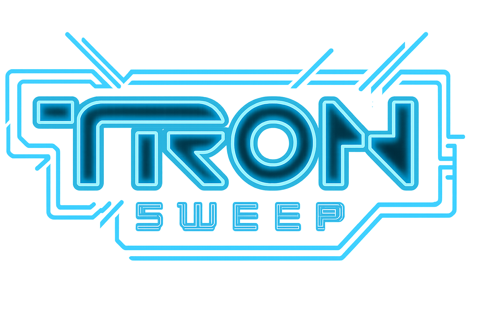

## Overview

**Tron Sweep** is a TRON-inspired minesweeper-style game built with PixiJS. Uncover cells on the grid to reveal different disc types and earn rewards. Match multiple discs of the same type to win bigger prizes and unlock high score badges!

## Features

- **Grid-based gameplay**: Click to reveal cells and discover hidden discs.
- **High Score Badges**: Earn Double, Triple, and Mega badges by matching 10, 15, or 20+ discs respectively.
- **Reward System**: Different disc types have different values (Program, User, Clue, Flynn).
- **Animated UI**: Smooth animations powered by Motion (Framer Motion for PixiJS).
- **Responsive Design**: Works on desktop and mobile devices.
- **TRON-themed**: Neon aesthetics and sound effects inspired by the TRON franchise.

## Tech Stack

- **PixiJS** (v8.14.3) - 2D rendering engine
- **Motion** (v12.4.7) - Animation library
- **TypeScript** - Type-safe development
- **Vite** - Fast build tool
- **AssetPack** - Asset pipeline for textures and sounds

## Getting Started

### Prerequisites

- Node.js (v18+ recommended)
- pnpm (or npm/yarn)

### Installation

```bash
# Clone the repository
git clone <repository-url>

# Install dependencies
pnpm install

# Start the development server
pnpm dev
```

The game will be available at `http://localhost:8080`.

### Build for Production

```bash
pnpm build
```

## Game Rules

1. **Start a Sweep**: Click "Start" to begin a new game (costs 1000 credits per sweep).
2. **Reveal Cells**: Click on cells to reveal disc types.
3. **Match Discs**: Match 5+ of the same disc type to win rewards.
4. **High Scores**: Match 10+ for Double (2x), 15+ for Triple (3x), or 20+ for Mega (4x) multipliers.
5. **Balance**: Keep playing as long as you have enough credits for the sweep cost.

## Disc Values

- **Program** (Blue): 100 credits
- **User** (Cyan): 200 credits
- **Clue** (Green): 500 credits
- **Flynn** (Orange): 1000 credits

## Configuration

Game settings can be adjusted in `src/app/config/config.ts`:

- Grid size (rows, columns, cell size)
- Sweep cost and starting balance
- High score thresholds and multipliers
- Cell reward values

## Disclaimer

Tron Sweep is a fan-made, non-commercial work inspired by the TRON franchise. All TRON-related assets, names, imagery, music, and sounds are the property of their respective owners, including Disney. This game is not affiliated with, endorsed by, or associated with Disney or any official TRON property. For educational and demonstration purposes only.

## Version

Current version: **1.0.2**

See [PATCH_NOTES.md](PATCH_NOTES.md) for detailed change history.

## License

This project is for educational and demonstration purposes only.
